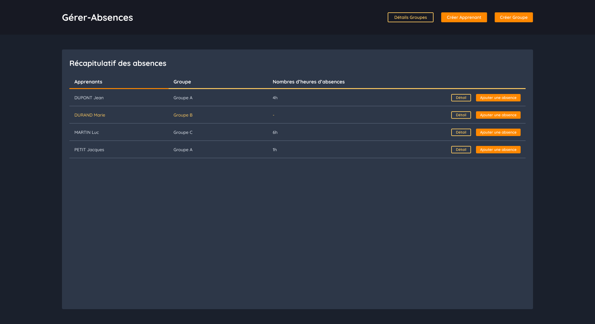

<!-- PROJET LOGO -->
 

  <h3 align="center">Gérer Absences</h3>

<!-- A PROPOS -->
## À propos du projet

  

 

Ce projet est un petit exercice pour apprendre la programmation d'application web en PHP. Le but était de gérer les absences des tous les apprenants d'une base de données.

### Fonctionnalités

Voici les fonctionnalités qui étaient demandées :
- [x] Afficher une page du récapitulatif des absences.
- [x] Lister les absences des apprenants.
- [x] Créer, modifier et supprimer des absences.

Je voudrais par la suite réaliser une extension à ce petit exercice voici les tâches à faire :
- [ ] Lister tous les groupes existants.
- [ ] Créer, modifier, supprimer des groupes et des apprenants.

<!-- BUILT WITH -->
## Construit avec

Backend :
- PHP (avec [Slim](https://www.slimframework.com/))
- SQLite

Frontend :
- Javascript
- HTML, CSS

<!-- CONFIGURATIONS -->
## Configurations

La configuration a été faite sur UwAmp, avec PHP 8.2.1

### Apache Configurations

Les modules à activer.
- actions_module
- rewrite_module